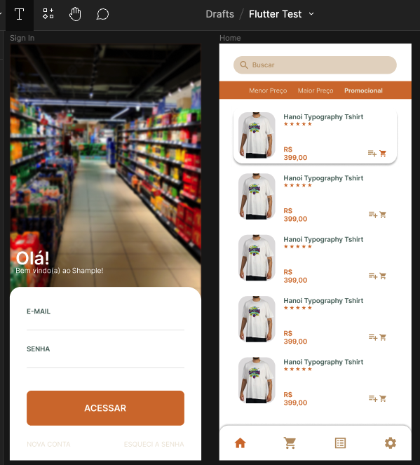
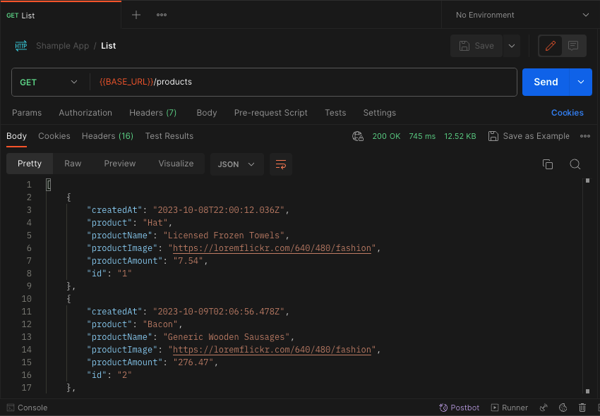

  
Shample App

  
Shop + Example</>
  

    <a href="">Resumo</a> •
    <a href="">Protótipo</a> •
    <a href="">Collection</a> •
    <a href="">Observação</a>
  

## Resumo

Projeto em desenvolvimento utilizando Flutter. Durante o processo de estruturação, foi utilizado para navegação o `GoRouter`, para gerenciamento de estado o `Bloc` e consumação de API o `Dio`.

## Protótipo
Como parte do processo que estou habituado, foi desenvolvido um protótipo com base na necessidade, isso, para que fosse seguido durante o desenvolvimento.
A plataforma escolhida para esse trabalho foi o `FIGMA`, a seguir há o link de acesso do mesmo para visualização.

[[LINK] Shample App - Protótipo](https://www.figma.com/file/QBJrOl9XF44U0mAFIc2Kx9/Flutter-Test?type=design&node-id=0%3A1&mode=design&t=urDQVpoSUjhJjeMU-1)

## Collection
Assim como o protótipo, tenho como costume o acompanhamento do ambiente, neste caso, da API que será consumida. Para isso, inseri em uma collection do `Postman` os endpoints do Mock em uso no projeto. Facilitando assim os testes e identificação de padrões e possíveis erros. 

[Collection](readme_files/ShampleApp.postman_collection.json)

## Observação
> É interessante ressaltar que o projeto **não foi finalizado**