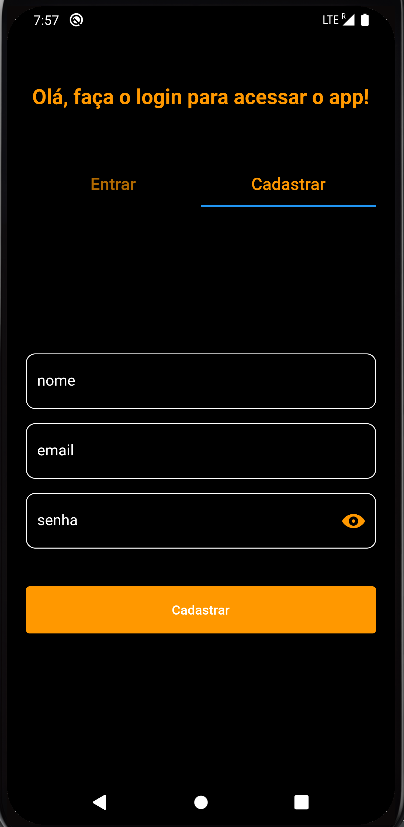
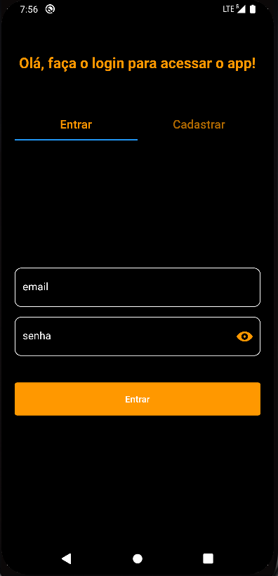
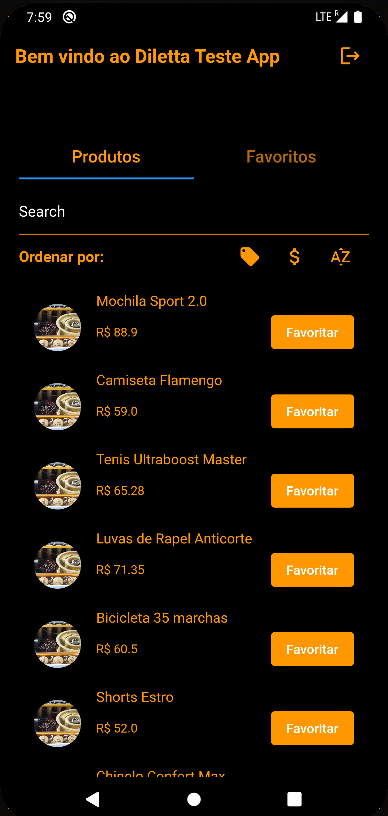
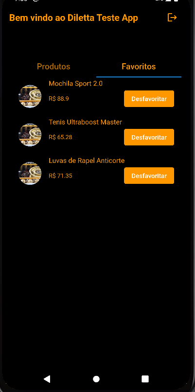

# Diletta Flutter Test

## Implementação:
- a versão utilizada foi o Flutter 3.10.6 e Dart 3.0.6
- O Aplicativo foi organizado com **Clean Architecture** 
- Injeção de dependencia com **GetIt**
- Todo gerenciamento de estado foi feito com **Bloc** estados e eventos foram criadas no mesmo arquivo.
- Para a persistencia foi utilizado o **SharedPreferences**
- Para autenticação e cadastro de usuarios foi utilizado o **Firebase**  pela sua simplicidade e agilidade
- Para o backend de produtos, foi utilizado a sugestão que estava na documentação com **https://mockapi.io/** e foi utilizado uma biblioteca simples *http* para trazer esses dados.
- Tambem foi colocado um **BlocOberver** para acompanhar o comportamento dos blocs dentro da aplicac1a2o e facilitar o desenvolvimento

## Visualização
- Quando o usuario entra no App ele se depara com uma *TabBar* com 2 abas **Entrar** e **Cadastrar**
  
  "
- Quando o usuario faz o login é possivel ver a tela de **Produtos** com 4 tipos de ordenações e filtros
  - Na barra de pesquisa é possivel pesquisar pelo nome.
  - Quando o usuario clica no primeiro icone, é possivel filtrar por produtos promocionais.
  - Quando o usuario clica no segundo icone, é possivel ordenar por preço.
  - Quando o usuario clica no terceiro icone,é possivel ordenar por ordem alfabética.
  
- Se o usuário clicar no botão favoritar, na aba favoritos é possivel ver os produtos favoritados.
  - Para finalizar, quando o usuarioterminar de usar o app é possivel deslogar clicando no icone de saída, ao lado da mensagem de recepção.
  
    
